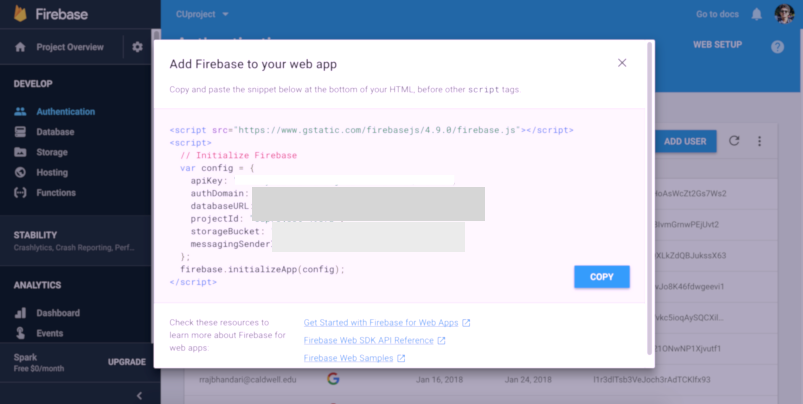
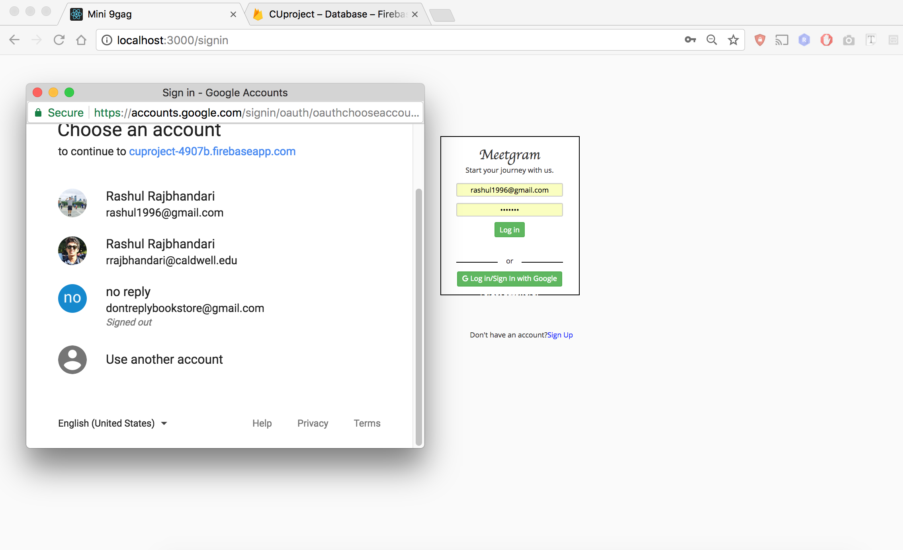
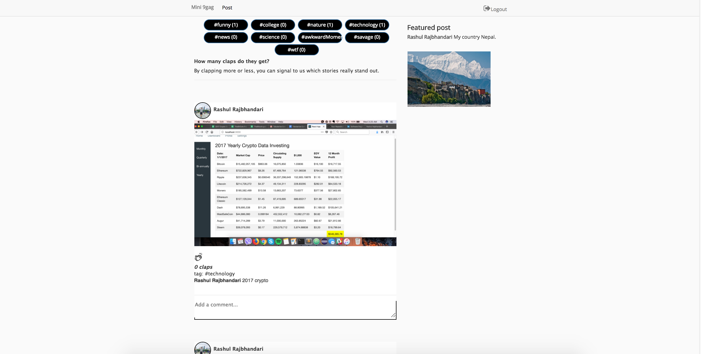
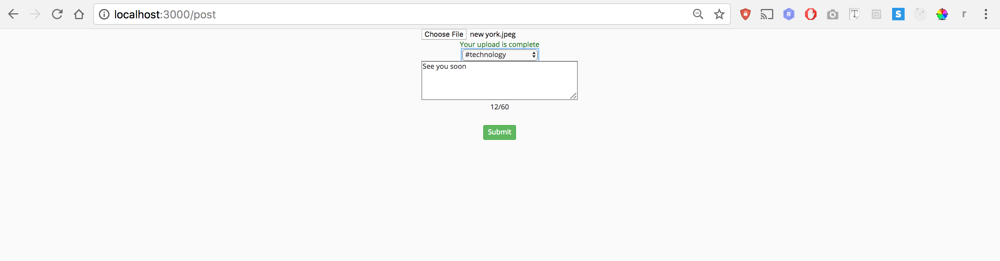
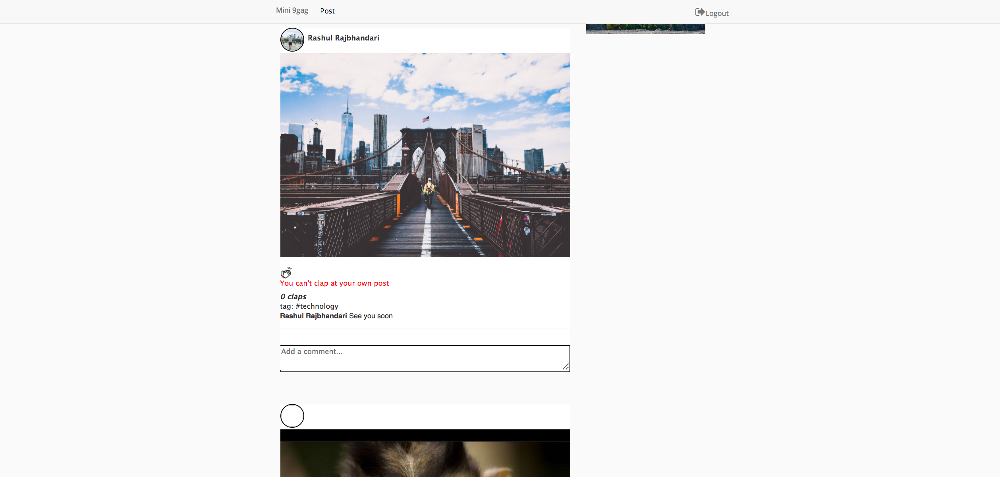
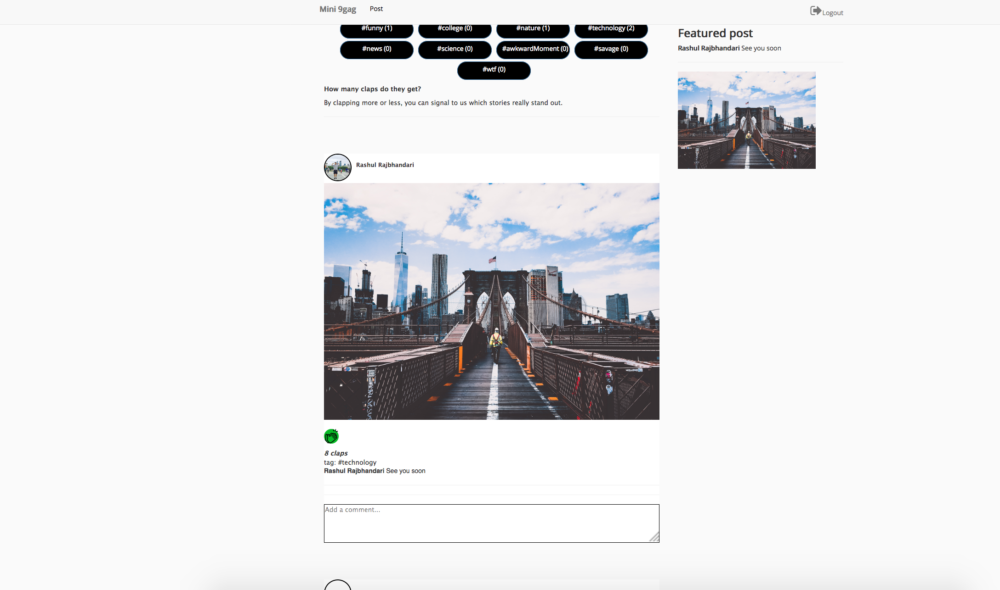
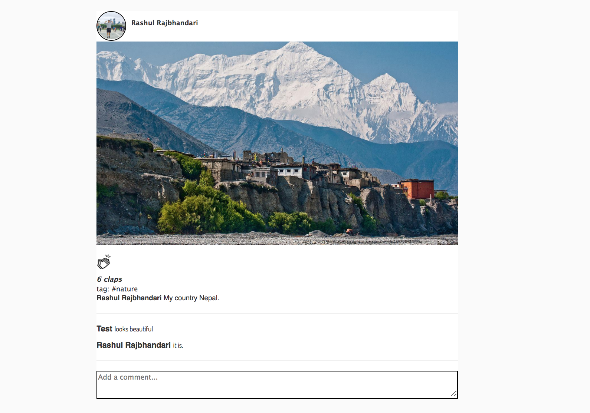

<h2>Mini 9Gag</h2>

A minimilistic version of 9gag built with React and Firebase

   

<h2> Getting started </h2>

<h3>Installation</h3>
-Install Node.js + React
   

- Add firebase to your project
Use your firebase crendentials and store it in -src/firebase.js

 
- git clone https://github.com/Raashul/CU-CS-club.git

cd instagram-clone

npm install

   

<h3>Running the app</h3>

npm start

<h3><strong> Demo: </strong> </h3>

<strong>1. Let's sign up by google</strong>

     

 <strong>2. Let's checkout the homepage</strong> 

     

 <strong>3. Let's try to post an image </strong>

     

 <strong>4. Let's try to change the featured post</strong>

 I. You can't clap at your own posts

 II. I love this picture of the Brooklyn Bridge so I clapped a bunch of times

     

 <strong> 5. Comments </strong> 

Posting comments are dynamic

<h3>Built with</h3>
<ul>
  <li>React</li>
  <li>Firebase</li>
  <li>React Bootstrap</li>
</ul>

<h3>Contribution</h3>

 <strong>Design</strong

<ul>
  <li>Aamosh Dahal</li>
  <li>Madhu Sujan Paudel</li>
  <li>Bigyan Karki</li>
</ul>
